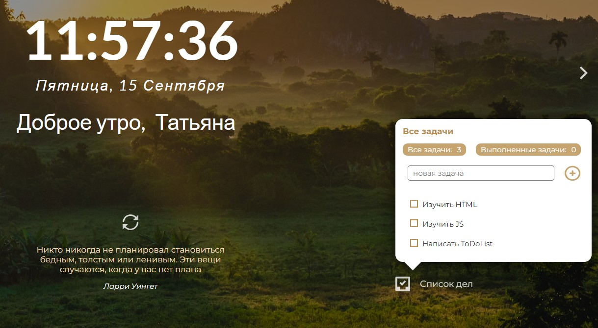
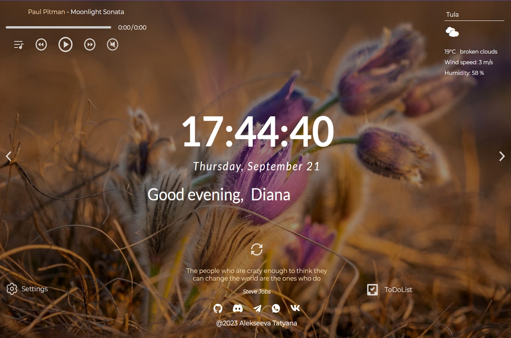

# Momentum

Аналог одноимённого приложения интернет-магазина Chrome. Приложение показывает время и имя пользователя. Фоновое изображение и приветствие меняются в зависимости от времени суток.
В приложении есть часы, слайдер изображений, виджеты погоды, аудиоплеер, блок цитата дня, список задач, настройки. Для хранения имени пользователя,населённого пункта, списка задач и настроек используется локальное хранилище - local storage.

## **Ключевые навыки:**

* Методы поиска элементов
* Вывод данных на страницу
* Работа с датой и временем
* Работа с аудио
* Сохранение данных в local storage
* Использование рекурсивного setTimeout
* Деление js-кода на модули
* Рработа с асинхронными запросами

## **Описание проекта**

### ***Часы и календарь***

* Время выводится в 24-часовом формате.
* Время обновляется каждую секунду - часы идут. Когда меняется одна из цифр, остальные при этом не меняют своё положение на странице (время не дёргается).
* Выводится день недели, число, месяц.

### ***Приветствие***

* Текст приветствия меняется в зависимости от времени суток (утро, день, вечер, ночь).
* Пользователь может ввести своё имя. При перезагрузке страницы приложения имя пользователя сохраняется, данные о нём хранятся в local storage.

### ***Смена фонового изображения***

* При загрузке или перезагрузке приложения фоновое изображение выбирается из расположенной на GitHub коллекции изображений.
* Ссылка на фоновое изображение формируется с учётом времени суток и случайного номера изображения (от 01 до 20).
* Изображения можно перелистывать кликами по стрелкам, расположенным по бокам экрана.
* Изображения перелистываются последовательно - после 18 изображения идёт 19 (клик по правой стрелке), перед 18 изображением идёт 17 (клик по левой стрелке).
* Изображения перелистываются по кругу: после двадцатого изображения идёт первое (клик по правой стрелке), перед 1 изображением идёт 20 (клик по левой стрелке).
* При смене слайдов обеспечена плавная смена фоновых изображений.

### ***Виджет погоды***

Данные о погоде предоставляют API погоды: ***OpenWeatherMap API***.

* Город по умолчанию - Москва, пока пользователь не ввёл другой город.
* При перезагрузке страницы приложения указанный пользователем город сохраняется, данные о нём хранятся в local storage.
* Для указанного пользователем населённого пункта выводятся данные о погоде, если их возвращает API.
* Данные о погоде включают в себя: иконку погоды, описание погоды, температуру в °C, скорость ветра в м/с, относительную влажность воздуха в %. Числовые параметры погоды округляются до целых чисел.
* Выводится уведомление об ошибке при вводе некорректных значений, для которых API не возвращает погоду (пустая строка или бессмысленный набор символов).

### ***Виджет цитата дня***

* При загрузке страницы приложения отображается рандомная цитата и её автор.
* В качестве источника цитаты использован созданный JSON-файл с цитатами и их авторами.
* При перезагрузке страницы цитата обновляется (заменяется на другую). Есть кнопка, при клике по которой цитата обновляется (заменяется на другую).

### ***Список задач***

* Виджет позволяет добавлять новые задачи в список.
* Есть возможность отмечать выполненные задачи и удалять элементы.
* Автоматически происходит сохранение списка дел в localStorage (необходимо для восстановления последнего состояния списка при повторном открытии страницы).
* Отображается общее количество задач и количество выполненных задач.

### ***Аудиоплеер***

* При клике по кнопке Play/Pause проигрывается первый трек из блока play-list, иконка кнопки меняется на Pause.
* При клике по кнопке Play/Pause во время проигрывания трека, останавливается проигрывание трека, иконка кнопки меняется на Play.
* Треки можно пролистывать кнопками Play-next и Play-prev.
* Треки пролистываются по кругу - после последнего идёт первый (клик по кнопке Play-next), перед первым - последний (клик по кнопке Play-prev).
* Трек, который в данный момент проигрывается, в блоке Play-list выделяется стилем.
* После окончания проигрывания первого трека, автоматически запускается проигрывание следующего. Треки проигрываются по кругу: после последнего снова проигрывается первый.
* Плейлист генерируется средствами JavaScript.
* Добавлен прогресс-бар в котором отображается прогресс проигрывания.
* При перемещении ползунка прогресс-бара меняется текущее время воспроизведения трека.
* Над прогресс-баром отображается название трека
* Отображается текущее и общее время воспроизведения трека.
* Есть кнопка звука при клике по которой можно включить/отключить звук.
* Можно запустить и остановить проигрывания трека кликом по кнопке Play/Pause рядом с ним в плейлисте.

### ***Перевод приложения***

* Переводится язык и меняется формат отображения даты.
* Переводится приветствие и placeholder.
* Переводится прогноз погоды в т.ч описание погоды и город по умолчанию.
* Переводится цитата дня (создан JSON-файл с цитатами на двух языках).
* Переводятся настройки приложения. При переключении языка приложения в настройках, язык настроек тоже меняется.
* Не переводятся данные, которые вводит пользователь: имя, город, тег для получения фонового изображения от API.

### ***Получение фонового изображения от API***

* Фоновые изображения, полученные от API, отвечают требованиям к фоновым изображениям: их можно перелистывать кликами по стрелкам, обеспечивается плавная смена фоновых изображений, ссылка на фоновое изображение формируется с учётом времени суток, если пользователь не указал другие теги для их получения.
* В качестве источника изображений может использоваться Unsplash API и Flickr API

### ***Настройки***

* В настройках приложения можно указать язык приложения (en/ru).
* В настройках приложения можно указать источник получения фото для фонового изображения: коллекция изображений GitHub, Unsplash API, Flickr API.
* Eсли источником получения фото указан API, в настройках приложения можно указать тег/теги, для которых API будет присылать фото. Например, nature - фото про природу.
* В настройках приложения можно скрыть/отобразить любой из блоков, которые находятся на странице: время, дата, приветствие, цитата дня, прогноз погоды, аудиоплеер, список дел.
* Скрытие и отображение блоков происходит плавно, не влияя на другие элементы, которые находятся на странице, или плавно смещая их.
* Настройки приложения сохраняются при перезагрузке страницы

## **Стек технологий**

## [**Демо**](alekseeva-t-v.github.io/momentum/)
